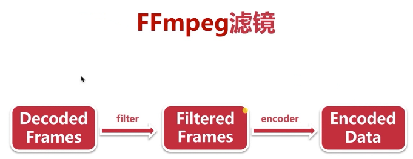
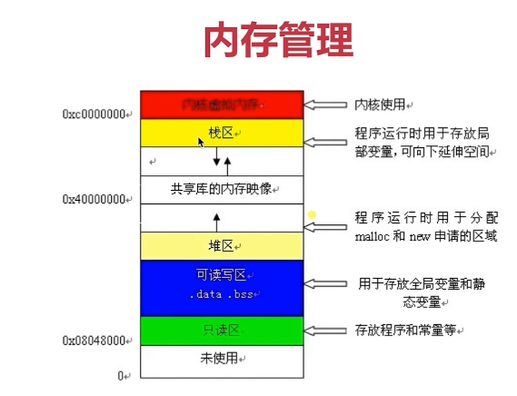

# FFmpeg

## 零、音视频背景知识

### 0.1 音视频的广泛应用

- 直播类：音视频会议、教育直播、娱乐/游戏直播等
- 短视频：抖音、快手、小咖秀
- 网络视频：优酷、腾讯视频、爱奇艺等
- 音视频通话：微信、QQ、Skype 等
- 视频监控
- 人工智能：人脸识别、智能音箱等（关注算法）

### 0.2 播放器的架构

1. 多媒体文件解复用（将多媒体文件，音视频流与视频流拆流）

2. 拿到音频流与视频流，然后分别进行解码。

    - 音频流解码--> PCM 数据
    - 视频流解码--> YUV 数据

3. 音频播放器，播放 PCM数据；

    视频渲染，播放 YUV 数据

4. 音视频同步

**步骤 1、2 主要是由 FFmpeg 负责**

**步骤 3 主要由 SDL 库负责**

 

### 0.3 渲染流程

1. 视频解码为 YUV 数据，YUV 数据交给**渲染器**，计算出**纹理**
2. 将纹理拷贝到显卡
3. 显卡经过计算，显示到屏幕


---

## 一、FFmpeg 背景

### 1.1 FFmpeg 的前世今生

- 2000 年，由 FabriceBellard 创建
- 2004 年，Michael Niedermayer 接管
- 2011 年，Libav 从 FFmpeg 分离

### 1.2 FFmpeg 可以做什么？

- FFmpeg 是一个非常优秀的**多媒体框架**
- FFmpeg 可以运行在 Linux、Mac，Windows等平台
- 能够解码，编码，转码，复用，解复用，过滤音视频数据

### 1.3 FFmpeg 版本分类

- Static 版：仅包含 3 个体积很大的 `.exe`文件
- Shared 版：包含了 3 个体积较小的 `.exe`文件及**dll 动态库文件**
- Dev 版:包含了**开发用的头文件`.h`** 和 **导入库文件`.lib`**，音视频开发者需要下载。

### 1.4 FFmpeg Ubuntu 源码安装

```
./configure --prefix=/home/annjeff/FFmpeg --enable-shared --enable-gpl --enable-version3 --enable-sdl2 --enable-fontconfig --enable-gnutls --enable-iconv --enable-libass  --enable-libbluray  --enable-libmp3lame --enable-libopencore-amrnb --enable-libopencore-amrwb  --enable-libopus --enable-libshine --enable-libsnappy --enable-libsoxr --enable-libtheora --enable-libtwolame --enable-libvpx --enable-libwavpack --enable-libwebp --enable-libx264 --enable-libx265 --enable-libxml2 --enable-lzma --enable-zlib --enable-gmp --enable-libvorbis --enable-libvo-amrwbenc  --enable-libspeex --enable-libxvid --enable-libaom     --enable-avisynth --enable-libopenmpt --enable-libfdk-aac --enable-nonfree
```


##  二、FFmpeg 常用命令

### 2.1 FFmpeg 命令分类


### 2.2 FFmpeg 处理流程


- 对输入文件（例如 mp4,avi 等封装数据），进行**解复用**操作
- 解复用后，我们得到**编码数据包**（其中包含音频、视频）
- 对编码数据包进行**解码**操作，得到**解码后的数据帧**（和原始摄像头采集的数据有部分不同）
- 对解码后的数据进行**各种各样的处理**（比如720P 转 480P）
- 对处理后的解码后数据帧进行**编码**
- 编码后**封装**编码数据包，得到输出文件

例子：将 Mp4 格式视频，转换为 avi格式

1. 对输入 mp4 文件进行**demuxer**得到编码数据包
2. 因为仅仅转换封装格式，所以可以不用**decoder**再**encoder**
3. 对 **demuxer得到的编码数据包**进行 avi 格式 **muxer**,即可输出 avi 格式视频

例 2：将1080P --> 720P

1. 将 1080P视频**demuxer**,得到**编码数据包**
2. 对编码数据包**decoder**得到**解码后数据帧**
3. 对解码后数据帧进行**降分辨率操作**（将1080P转720P)
4. 对操作后的数据重新**encoder**，得到**编码数据包**
5. 对编码数据包进行**muxer**得到 720P视频输出文件

### 2.3 基本信息查询命令


### 2.4 录制命令

#### 2.4.0 桌面与音频捕获设备

FFmpeg Devices Documentation: <https://ffmpeg.org/ffmpeg-devices.html#Options-20>

- Mac

    - avfoundation

- Windows

    - dshow (Windows DirectShow input device.)

        - 依赖：screen-capture-recorder (include virtual-audio-capturer)  桌面捕获设备 和 音频捕获设备

        - > ```
            > ffmpeg -list_devices true -f dshow -i dummy
            > ```
            >
            > Print the list of DirectShow supported devices and exit

    - gdigrab (Win32 GDI-based screen capture device, This device allows you to capture a region of the display on Windows.)

- Linux 

    - alsa （Advanced Linux Sound Architecture）
    - X11 grab

#### 2.4.1 录制视频

- Mac

> ffmpeg -f avfoundation -i 1 -r 30 out.yuv
>
> -f：指定使用 avfoundation 库采集数据 （Mac 系统专用的专用于音视频处理）
>
> -i: 指定从哪采集数据，它是一个**文件索引号**
>
> > 0: 代表摄像头
> >
> > 1: 代表屏幕（因为我们是录制，所以输入是屏幕）
>
> -r: 指定帧率（一般25帧比较流畅，15帧勉强可以接受，高清电影一般60帧以上）
>
> out.yuv: **yuv数据是一种原始的数据格式**，采集到是什么样子，存成什么样子，无压缩，数据量大。

- Windows 抓取屏幕

```
# -t 10 for 10 seconds recording
ffmpeg -f dshow  -i video="screen-capture-recorder"  -r 20 -t 10 screen-capture.mp4
```


- Windows 抓取摄像头

```
ffmpeg -f dshow -i video="Camera" annjeffCamera.mp4
```


#### 2.4.2 录制音频

> ffmpeg -f avfoundation -i :0 out.wav
>
> :0 代表**音频设备**

#### 2.4.3 FFmpeg 是否可以同时录制视频与音频？

当然可以！！！

- Windows 同时录制音视频

> ffmpeg -f dshow -i audio="virtual-audio-capturer":video="screen-capture-recorder" annjeffVideo.mp4
>
> 同时指定了获取位置与视频获取位置，保存格式为：.mp4

### 2.5 分解(demuxer)与复用(muxer)

> 例如，将视频中的音频抽取出来（分解），视频如果抽取出来是未解码的 `H.264`文件，音频抽取出来是未解码的`AAC` 文件。

#### 2.5.1 多媒体格式转换

```
ffmpeg -i out.mp4 -vcodec copy -acodec copy out.flv

-i: 输入文件 
-vcodec copy: 视频编码处理方式
-acodec copy: 音频编码处理方式

copy：意味着不对视频音频参数进行调整

# 抽取 in.mov 视频中的视频，保存为 h.264
ffmpeg -i in.mov -an -vcodec copy out.h264
-an:表示不要音频 [n:代表 no]

# 抽取音频，不要视频(抽取了音频，保存为.aac 格式)
ffmpeg -i in.mov -acodec copy -vn out.aac

```


### 2.6 处理原始数据命令

#### 2.6.1 什么是原始数据

> 这里，我们讲的`原始数据即`**ffmpeg 解码后的数据** ，音频是`PCM 数据`；视频是 `YUV 数据`。

#### 2.6.2 FFmpeg 提出 YUV 数据

```
ffmpeg -i input.mp4 -an -c:v rawvideo -pix_fmt yuv420p out.yuv
# -an:表示结果里不包含音频
# -c:v rawvideo: 对视频使用 rawvideo 进行编码
# -pix_fmt yuv420p：指定像素格式为：yuv420p
# yuv,4:2:0 是音视频最常用的格式
```

> Note: .yuv 视频无法直接使用 ffplay 播放，需要制定视频宽高才能顺利播放
>
> ```
> ffplay -s widthxheight xxx.yuv
> ```

#### 2.6.3 FFmpeg 提取 PCM 数据

```
ffmpeg -i input.mp4 -vn -ar 44100 -ac 2 -f s16le out.pcm
# -vn: 不要视频
# -ar 44100：a 代表 audio r 代表 read，音频的采样率
# -ac 2: a 代表 audio c 代表 channel ，2 指定声音双声道
# -f s16le: 抽取出的音频的存储格式为  sl16le
```

> Note: xxx.pcm 数据同样无法直接使用 ffplay 播放，需要指定 采样率，声道数，数据存储格式
>
> `ffplay -ar 44100 -ac 2 -f s16le out.pcm`

### 2.7 FFmpeg 滤镜命令

> 视频加减水印、画中画、视频裁剪、音频倍速都可通过滤镜实现。

### 2.7.1 FFmpeg 滤镜工作流程



 #### 2.7.2 FFmpeg 滤镜命令

```
ffmpeg -i input.mov -vf crop=in_w-200:in_h-200 -c:v libx264 -c:a copy out.mp4
# 可以指定x,y 起始点， 默认是中心点
# -vf crop=in_w-200:in_h-200：-vf 代表视频滤镜，具体是 crop滤镜，in_w 视频宽度 in_w-200 本身视频宽度 - 200
# -c:v libx264：指定视频的编码器
```

### 2.8 裁剪与合并命令

#### 2.8.1 FFmpeg 音视频裁剪

```
ffmpeg -i input.mp4 -ss 00:00:00 -t 10 out.ts
# -ss 00:00:00: 指定开始裁剪时间
# -t 10: 指定裁剪时长
```

#### 2.8.2 FFmpeg 音视频合并

```
ffmpeg -f concat -i inputs.txt out.flv
# -f concat: 告诉 FFmpeg 对后面文件进行拼接
# -i inputs.txt: 文件列表，记录了所有希望合并的文件名字(*.txt 即可)
## *.txt 内容为：'file filename'格式（每一行代表一个单独的文件）

> 将 dream.mp4 与 dream.flv 拼接到一起
> file 'dream.mp4'
> file 'dream.flv'
```

### 2.9 图片 / 视频互转命令

#### 2.9.1 视频转图片

```
ffmpeg -i input.flv -r 1 -f image2 image-%3d.jpeg
# -r 1: 指定转换图片的帧率，一秒转1张图片
# -f image2: 指定多媒体文件转成什么格式，image 是一种协议格式，image2 是第二版
# image-%3d.jpeg: 输出文件，%3d 有3 个数字组成
```

#### 2.9.2 图片转视频

```
ffmpeg -i image-%3d.jpeg out.mp4
# 要转视频的图片命名需要指定固定的格式
```

### 2.10 直播推流 / 拉流

#### 2.10.1 直播推流

```
ffmpeg -re -i input.mp4 -c copy -f flv rtmp://server/live/streamName
# -re: 减慢帧率速度，本地文件播放，会尽可能快的播放。加了 -re 会让帧率减慢
# -c copy:音视频编解码 -c:a 专门制定音频 -c:v 专门制定视频
# -f flv: 指定的推出去流的格式
# server(IP 低着)

```

#### 2.10.2 直播拉流

```
ffmpeg -i rtmp://server/live/streamName -c copy save.mp4
```


## 三、Vim 编辑器

### 3.1 处理模式

- 命令模式
    - 拷贝、删除、粘贴等，可以通过 i(insert) / a(append) / o 等键切换到编辑模式
- 编辑模式
    - 编辑字符，通过 Esc 键或者 ctrl + [ 组合键，切换回命令模式

### 3.2 常用命令

- 创建文件
    - vim filename
- 保存文件
    - `:w`
- 关闭文件
    - `:q`
- 拷贝
    - `yy `： 代表拷贝一行
    - `yw `： 拷贝一个词
- 粘贴
    - `p` 将拷贝命令放进缓冲区的内容粘贴出来
- 删除
    - `dd`: 删除一行
    - `dw`: 删除一个词
- 光标移动
    - 左下右上：`h / j / k / l`
    - 跳转到文件头： `gg`
    - 跳转文件尾部:  `G`
    - 移动到行首：`^`
    - 移动到行尾： `$`
    - 按单词移动：向前 `w`、`2w`；向后 n 词：`b（back）`、`2b`
- 查找与替换
    - 查找关键字：`/关键字`
    - 替换：`%s(search)/关键字/替换字/gc(c 指定要用户决定是否替换)`
- 多窗口
    - `split`: 横向切分窗口
    - `vsplit`: 竖向切换窗口
    - 窗口间跳转：` ctrl ww` / `ctrl w [hjkl]`

## 四、C 语言基础

### 4.1 常用基本类型

- short、int、long
- float、double
- char
- void

### 4.2 内存管理



```c
#include <stdio.h>                                                      #include <stdlib.h>
int main(int argc, char* argv[])
{
     int* p_a, *p_b;
     printf("addr of p_a:%p\n", &p_a);
     printf("addr of p_b:%p\n\n", &p_b);
    
     // 为指针申请内存空间
     p_a = (int*)malloc(sizeof(int));
     p_b = (int*)malloc(sizeof(int));
     
     printf("p_a 指向的内存区域是:%p\n", p_a);
     printf("p_b 指向的内存区域是:%p\n\n", p_b);
     // 为申请的内存空间赋值
     *p_a = 99;
     *p_b = 88;
     printf("p_a 指向的空间中存储的数据是:%d\n", *p_a);                             
     printf("p_b 指向的空间中存储的数据是:%d\n\n", *p_b);
 
     return 0;
}
```

### 4.3 指针

- 指针的物理意义
    - 它就是内存中的一个地址
- 指针本身运算
    - 指针可进行 `+`、`-`、`*`运算
- 指针所指向内容
    - 指针所指向的内容可以进行`+`、`-`、`*`、`/`

### 4.4 编译命令

```
gcc -g -O2 -o app test.c -I... -L... -l
#-g: 输出文件中的调试信息
#-O: 对输出文件做指令优化，默认 O1 不对指令进行优化 ；O2 做第2 级别优化
#-o: 输出文件名字
#-I: 指定头文件位置 （第三方库头文件，或者自己写的头文件不在一起 需要指定头文件位置）
#-L: 指定第三方库文件位置 
#-l: 指明具体只用的库
```

### 4.5 编译过程

- 预编译
    - 将头文件与源代码拷贝到一起
- 编译
- 链接，动态链接库 / 静态链接库

 ## 五、FFmpeg 多媒体文件处理

### 5.1 初级开发介绍

- FFmpeg 日志的使用及目录操作
- 介绍 FFmpeg 的基本概念及常用的结构体
- 对复用 / 解复用及流操作的各种实践

- FFmpeg 代码结构

    - |      库       |                       功能                        |
        | :-----------: | :-----------------------------------------------: |
        |  libavcodec   |           提供了一系列**编码器**的实现            |
        |  libavformat  | 实现在**流协议**、**容器格式**及**基本 IO 访问**  |
        |   libavutil   | 包括了**hash 器**、**解码器**、和**各种工具函数** |
        |  libavfilter  |            提供了**各种音视频过滤器**             |
        |  libavdevice  |    提供了**访问捕获设备**和**回放设备**的接口     |
        | libswresample |            提供了**混音**和**重采样**             |
        |  libswscale   |         实现了**色彩转换**和**缩放**功能          |

### 5.2 FFmpeg 日志系统

```c
#include <libavutil/log.h>
// 设置日志级别，设置哪些日志需要打印，此处设置 DEBUG 级别日志
// DEDUG 及之上所有日志都会打印出来	Warning、Error、Info 都会打印出来
// DEBUG ：是FFmpeg 系统中最低级别的日志
// 如果设置了 ERROR 级别的日志，DEBUG 级别的日志则不会被打印出来
av_log_set_level(AV_LOG_DEBUG)
// 第一个参数：NULL
// 第二个参数：日志级别
// 第三个及以后与 printf 类似
av_log(NULL, AV_LOG_INFO, "...%s\n", op)

// gcc -g -o ffmpeg_log ffmpeg_log.c -lavutil   
```

- **常用日志级别**
    - AV_LOG_ERROR
    - AV_LOG_WARNING
    - AV_LOG_INFO

### 5.3 FFmpeg 文件与目录操作

> Note: `pkg-config`本身是一个 linux 命令,其功能是**用于获得某一个库/模块的所有编译相关的信息**.
>
> pkg-config --libs libavformat 
>
> // 可以找到 libavformat 库的路径

- 文件的删除

    - avpriv_io_delete()

    - ```c
        #include <stdio.h>
        #include <libavformat/avformat.h>
        #include <libavutil/log.h>                                                             
        
        int main(int argc, char* argv[])
        {
            // 删除一个文件
            int ret;
            ret = avpriv_io_delete("./mydeletedFile.txt");
            if(ret < 0){ 
                av_log(NULL, AV_LOG_ERROR, "Failed to delete file mydeletedFile.txt\n");
                return -1; 
            }   
        
            return 0;
        }
        
        // gcc ffmpeg_file.c -o ffmpeg_file `pkg-config --libs libavformat` -lavutil
        
        // gcc ffmpeg_file.c -o ffmpeg_file `pkg-config --libs libavformat` `pkg-config --libs libavutil`
        ```

- 文件重命名

    - avpriv_io_move()

    - ```c
        #include <stdio.h>                                                                     
        #include <libavformat/avformat.h>
        #include <libavutil/log.h>
        
        int main(int argc, char* argv[])
        {
            // 删除一个文件
            int ret;
            ret = avpriv_io_delete("./mydeletedFile.txt");
            if(ret < 0){
                av_log(NULL, AV_LOG_ERROR, "Failed to delete file mydeletedFile.txt\n");
                return -1;
            }
            // 成功删除文件后也打个 log
            av_log(NULL, AV_LOG_INFO, "Success to delete mydeletedFile.txt\n");
        
            // 文件重命名
            ret = avpriv_io_move("myRename.txt","newName.txt");
            if( ret < 0){
                av_log(NULL, AV_LOG_ERROR, "Failed to rename\n");
                return -1;
            }
            // 成功命名也打个 log                                                              
            av_log(NULL, AV_LOG_INFO, "Success to rename!\n");
        
            return 0;
        }
        
        ```

- 操作目录重要函数

    - avio_open_dir(): 打开目录
    - avio_read_dir(): 读取目录中每一项的信息
    - avio_close_dir(): 关闭目录

- 操作目录重要结构体

    - AVIODirContext: 操作目录的上下文
    - AVIODirEntry: 目录项，用于存放文件名，文件大小信息等

- 实战：实现简单的 `ls` 命令

    - ```c
        #include <libavutil/log.h>                                                                                                                                     
        #include <libavformat/avformat.h>
        
        int main(int argc, char* argv[])
        {
            // 声明上下文
            AVIODirContext  *ctx = NULL;
            int ret;
        
            // 设置日志级别
            av_log_set_level( AV_LOG_INFO);
            
            // 上下文 要操作的目录
            ret = avio_open_dir(&ctx, "./", NULL);
            if (ret < 0){
                // av_err2str(): 函数将错误码数字，转换成字符串
                av_log(NULL, AV_LOG_ERROR, "Cant open dir:%s\n", av_err2str(ret));
                return -1;
            }
            // 成功打开目录， 一项一项访问目录中文件
            AVIODirEntry *entry = NULL; // entry 目录中的每一项
            while( 1 ){
            ret = avio_read_dir(ctx, &entry);
            if (ret < 0){
                av_log(NULL, AV_LOG_ERROR, "Cann't read dir:%s\n", av_err2str(ret));
                goto __fail;
            }
        
            if (!entry){
                break;
            }
        
            av_log(NULL, AV_LOG_INFO, "%12"PRId64" %s \n",
                entry->size,
                entry->name);
            avio_free_directory_entry(&entry);
        
            }
            
        __fail:
            avio_close_dir(&ctx);
                                                                                                                                                                       
            return 0;
        }
        ```

### 5.4 多媒体 文件的基本概念

- 多媒体文件其实是个**容器**，容器中可以放，**音频数据**、**视频数据**、**字幕数据**等。
- 在容器里有很多**流 （Stream / Track）**又称**轨**
- 每种流是由不同的**编码器编码**的
- 从流中读出的数据成为**包**
- 在一个包中包含着**一个或多个帧**
- 几个重要的结构体
    - `AVFormatContext`：格式上下文，连接多个 API 之间的桥梁。例如打开多媒体文件时，首先创建一个 `AVFormatContext` 上下文，把基本信息放到上下文中，这样读取数据流时就要将上下文传到 FFmpeg 函数里，这样它就知道我在处理这个多媒体而不是别的多媒体。
    - `AVStream`:  流，或轨。打开一个多媒体文件后，所有的流都暴露在我们眼前，通过 `AVStream` 读取。
    - `AVPacket`: 包，从流中可以拿到一个个包。

- FFmpeg 操作流数据的基本步骤

    

### 5.5 [实战] 打印音 / 视频 Meta 信息

- `av_register_all()`: 该函数将 FFmpeg 中所定义的**编解码库**、**格式库**、**格式协议**、**网络协议**全部注册到程序中。**所有 FFmpeg 程序必须首先注册**
- `avformat_open_input()`: 打开一个多媒体文件，根据文件后缀名识别多媒体格式，然后输出 `AVFormatContxt`结构体；`avformat_close_input()`
- `av_dump_format()`: 将多媒体文件中的 meta 信息打印出来

```c
#include <libavutil/log.h>
#include <libavformat/avformat.h>

int main(int argc, char* argv[])
{
	// 初始 log 级别
	av_log_set_level(AV_LOG_INFO);
	
	av_register_all();

	AVFormatContext *fmt_ctx = NULL;
	// para1:为上下文结构体分配空间；para2:指定要打开的视频文件；para3:输入文件格式
	// para3: 设置为 NULl，程序则根据文件后缀名推断程序类型; para4:设置命令行参数
	int ret = avformat_open_input(&fmt_ctx, "/home/annjeff/Video/dream.mp4",NULL, NULL );
	if( ret < 0){
		av_log(NULL, AV_LOG_ERROR, "Cann't open file:%s\n", av_err2str(ret));
		return -1;
	}
	// para2:流的索引值；para3:输入文件名字；para4：指定是输入流还是输出流（入0出1）
	av_dump_format(fmt_ctx, 0,"/home/annjeff/Video/dream.mp4",  0);
	avformat_close_input(&fmt_ctx);

	return 0;
}
```

### 5.6 [实战] 抽取音频数据

- `av_init_packet()`: 初始化一个**数据包结构体**，从多媒体文件读取的每一个数据包， 都可以放在**被初始化的包结构体里**。
- `av_find_best_stream()`：在多媒体文件中找到**最好的一路流**
- `av_read_frame()`: 将流中的一个个数据包获取到，获取到数据包就可以做一些处理。
- `av_packet_unref()`: 每次当我们通过 `av_read_frame()` 从我们想要获取的流中读取数据后，数据包就会被增加引用计数。当我们不使用时，调用`av_packet_unref()` 将引用数 -1 ，FFmpeg 观察到引用计数为 0 时，就会释放相应的资源。

```c
#include <stdio.h>
#include <libavutil/log.h>
#include <libavformat/avformat.h>
#include <libavcodec/avcodec.h>

int main(int argc, char* argv[])
{
	int audio_index = 0;
    // 初始 log 级别
    av_log_set_level(AV_LOG_INFO);
    av_register_all();
 
    AVFormatContext *fmt_ctx = NULL;
    
     
    // Step 1: 从命令行获取两个参数
    // argv: 第一个参数是文件名，第二及以后是程序真正的参数
     if (argc < 3){
	    av_log(NULL, AV_LOG_ERROR, "The number of input fileName less than three\n");
        return -1;
    }
     
	char *src = argv[1];
	char *dst = argv[2];

    if (!src || !dst){
        av_log(NULL, AV_LOG_ERROR, "src or dst is NULL! \n");
    }
 	// para1:为上下文结构体分配空间；para2:指定要打开的视频文件；para3:输入文件格式
    // para3: 设置为 NULl，程序则根据文件后缀名推断程序类型; para4:设置命令行参数
    int ret = avformat_open_input(&fmt_ctx, src, NULL, NULL );
	if (ret < 0){
        return -1;
    }
    av_dump_format(fmt_ctx, 0,"/home/annjeff/Video/dream.mp4",  0);
     
    // 打开多媒体成功后，创建一个新的二进制文件
    FILE* dst_fd = fopen(dst,"wb");
    if ( !dst_fd ){
        av_log(NULL, AV_LOG_ERROR, "Cann't open out file!\n");
        avformat_close_input(&fmt_ctx);
        return -1;
    }
    //Step 2: 得到我们想处理的流
    ret = av_find_best_stream(fmt_ctx,AVMEDIA_TYPE_AUDIO, -1,-1, NULL,0 );
   
    if(ret < 0 ){
        av_log(NULL, AV_LOG_ERROR, "Cann't find the best stream!\n");
        avformat_close_input(&fmt_ctx);
        fclose(dst_fd);
        return -1;
    }
    audio_index = ret;
                                                                                    
    AVPacket pkt;
    av_init_packet(&pkt);
    while(av_read_frame(fmt_ctx, &pkt) >= 0 ){
        if ( pkt.stream_index == audio_index){
			int len = fwrite(pkt.data, 1, pkt.size, dst_fd);
			//Step 3: 将获取的音频数据输出到 acc file
			if (len != pkt.size){
				av_log(NULL, AV_LOG_WARNING, "warning, length of data is not equal size of pkt!\n");
        }
    }

	av_packet_unref(&pkt); // 减引用计数
	 
	 }
	avformat_close_input(&fmt_ctx);	
	// 关闭目标文件
	if (dst_fd){
		fclose(dst_fd);
	}
	return 0;
}
```

### 5.7[实战] 抽取视频数据

- `Start code`: 视频抽取后，由一帧一帧的视频帧组成，如何区分每一帧呢？我们可以**在每一帧前加帧的长度信息**、或者在**每一帧前加关键字或特征码**，此处 `Start code`:属于**特征码**
- `SPS / PPS`: 作用是：**解码的视频参数,视频帧的宽高、帧率等存放于 SPS / PPS 中**
- `codec->extradata`: FFmpeg 从 `codec->extradata` 中获取 `SPS / PPS`

```c
#include <stdio.h>
#include <libavutil/log.h>
#include <libavformat/avio.h>
#include <libavformat/avformat.h>

#ifndef AV_WB32
#   define AV_WB32(p, val) do {                 \
        uint32_t d = (val);                     \
        ((uint8_t*)(p))[3] = (d);               \
        ((uint8_t*)(p))[2] = (d)>>8;            \
        ((uint8_t*)(p))[1] = (d)>>16;           \
        ((uint8_t*)(p))[0] = (d)>>24;           \
    } while(0)
#endif

#ifndef AV_RB16
#   define AV_RB16(x)                           \
    ((((const uint8_t*)(x))[0] << 8) |          \
      ((const uint8_t*)(x))[1])
#endif

// 增加特征码
// sps 和 pps 特征码前是 4 个字节，其中是：00 00 00 01
// 非 sps 和 pps 特征码是 3 个字节，其中内容是：00 00 01
static int alloc_and_copy(AVPacket *out,
                          const uint8_t *sps_pps, uint32_t sps_pps_size,
                          const uint8_t *in, uint32_t in_size)
{
    uint32_t offset         = out->size;
    // 区分是 3 字节 还是 4 字节
    uint8_t nal_header_size = offset ? 3 : 4;
    int err;
	
    // 空间扩容
    err = av_grow_packet(out, sps_pps_size + in_size + nal_header_size);
    if (err < 0)
        return err;
	
    // 如果有 sps 或 pps 就先把 sps、pps拷贝过去；再将数据帧拷贝过去
    if (sps_pps)
        memcpy(out->data + offset, sps_pps, sps_pps_size);
    memcpy(out->data + sps_pps_size + nal_header_size + offset, in, in_size);
    // 没有偏移量，即 没sps、pps
    if (!offset) {
        AV_WB32(out->data + sps_pps_size, 1);
    } else {
        (out->data + offset + sps_pps_size)[0] =
        (out->data + offset + sps_pps_size)[1] = 0;
        (out->data + offset + sps_pps_size)[2] = 1;
    }

    return 0;
}

// 读取 sps、pps
int h264_extradata_to_annexb(const uint8_t *codec_extradata, const int codec_extradata_size, AVPacket *out_extradata, int padding)
{
    uint16_t unit_size;
    uint64_t total_size                 = 0;
    uint8_t *out                        = NULL, unit_nb, sps_done = 0,
             sps_seen                   = 0, pps_seen = 0, sps_offset = 0, pps_offset = 0;
    const uint8_t *extradata            = codec_extradata + 4;
    static const uint8_t nalu_header[4] = { 0, 0, 0, 1 };
    int length_size = (*extradata++ & 0x3) + 1; // retrieve length coded size, 用于指示表示编码数据长度所需字节数

    sps_offset = pps_offset = -1;

    /* retrieve sps and pps unit(s) */
    // 后 5 位
    unit_nb = *extradata++ & 0x1f; /* number of sps unit(s) */
    if (!unit_nb) {
        goto pps;
    }else {
        sps_offset = 0;
        sps_seen = 1;
    }

    while (unit_nb--) {
        int err;
	
        unit_size   = AV_RB16(extradata);
        total_size += unit_size + 4;
        if (total_size > INT_MAX - padding) {
            av_log(NULL, AV_LOG_ERROR,
                   "Too big extradata size, corrupted stream or invalid MP4/AVCC bitstream\n");
            av_free(out);
            return AVERROR(EINVAL);
        }
        if (extradata + 2 + unit_size > codec_extradata + codec_extradata_size) {
            av_log(NULL, AV_LOG_ERROR, "Packet header is not contained in global extradata, "
                   "corrupted stream or invalid MP4/AVCC bitstream\n");
            av_free(out);
            return AVERROR(EINVAL);
        }
        if ((err = av_reallocp(&out, total_size + padding)) < 0)
            return err;
        memcpy(out + total_size - unit_size - 4, nalu_header, 4);
        memcpy(out + total_size - unit_size, extradata + 2, unit_size);
        extradata += 2 + unit_size;
pps:
        if (!unit_nb && !sps_done++) {
            unit_nb = *extradata++; /* number of pps unit(s) */
            if (unit_nb) {
                pps_offset = total_size;
                pps_seen = 1;
            }
        }
    }

    if (out)
        memset(out + total_size, 0, padding);

    if (!sps_seen)
        av_log(NULL, AV_LOG_WARNING,
               "Warning: SPS NALU missing or invalid. "
               "The resulting stream may not play.\n");

    if (!pps_seen)
        av_log(NULL, AV_LOG_WARNING,
               "Warning: PPS NALU missing or invalid. "
               "The resulting stream may not play.\n");

    out_extradata->data      = out;
    out_extradata->size      = total_size;

    return length_size;
}

int h264_mp4toannexb(AVFormatContext *fmt_ctx, AVPacket *in, FILE *dst_fd)
{

    AVPacket *out = NULL;
    AVPacket spspps_pkt;

    int len;
    uint8_t unit_type;
    int32_t nal_size;
    uint32_t cumul_size    = 0;
    const uint8_t *buf;
    const uint8_t *buf_end;
    int            buf_size;
    int ret = 0, i;

    out = av_packet_alloc();

    buf      = in->data;
    buf_size = in->size;
    buf_end  = in->data + in->size;

    do {
        ret= AVERROR(EINVAL);
        if (buf + 4 /*s->length_size*/ > buf_end)
            goto fail;

        for (nal_size = 0, i = 0; i<4/*s->length_size*/; i++)
            nal_size = (nal_size << 8) | buf[i];

        buf += 4; /*s->length_size;*/
        unit_type = *buf & 0x1f;

        if (nal_size > buf_end - buf || nal_size < 0)
            goto fail;

        /*
        if (unit_type == 7)
            s->idr_sps_seen = s->new_idr = 1;
        else if (unit_type == 8) {
            s->idr_pps_seen = s->new_idr = 1;
            */
            /* if SPS has not been seen yet, prepend the AVCC one to PPS */
            /*
            if (!s->idr_sps_seen) {
                if (s->sps_offset == -1)
                    av_log(ctx, AV_LOG_WARNING, "SPS not present in the stream, nor in AVCC, stream may be unreadable\n");
                else {
                    if ((ret = alloc_and_copy(out,
                                         ctx->par_out->extradata + s->sps_offset,
                                         s->pps_offset != -1 ? s->pps_offset : ctx->par_out->extradata_size - s->sps_offset,
                                         buf, nal_size)) < 0)
                        goto fail;
                    s->idr_sps_seen = 1;
                    goto next_nal;
                }
            }
        }
        */

        /* if this is a new IDR picture following an IDR picture, reset the idr flag.
         * Just check first_mb_in_slice to be 0 as this is the simplest solution.
         * This could be checking idr_pic_id instead, but would complexify the parsing. */
        /*
        if (!s->new_idr && unit_type == 5 && (buf[1] & 0x80))
            s->new_idr = 1;

        */
        /* prepend only to the first type 5 NAL unit of an IDR picture, if no sps/pps are already present */
        if (/*s->new_idr && */unit_type == 5 /*&& !s->idr_sps_seen && !s->idr_pps_seen*/) {

            h264_extradata_to_annexb( fmt_ctx->streams[in->stream_index]->codec->extradata,
                                      fmt_ctx->streams[in->stream_index]->codec->extradata_size,
                                      &spspps_pkt,
                                      AV_INPUT_BUFFER_PADDING_SIZE);

            if ((ret=alloc_and_copy(out,
                               spspps_pkt.data, spspps_pkt.size,
                               buf, nal_size)) < 0)
                goto fail;
            /*s->new_idr = 0;*/
        /* if only SPS has been seen, also insert PPS */
        }
        /*else if (s->new_idr && unit_type == 5 && s->idr_sps_seen && !s->idr_pps_seen) {
            if (s->pps_offset == -1) {
                av_log(ctx, AV_LOG_WARNING, "PPS not present in the stream, nor in AVCC, stream may be unreadable\n");
                if ((ret = alloc_and_copy(out, NULL, 0, buf, nal_size)) < 0)
                    goto fail;
            } else if ((ret = alloc_and_copy(out,
                                        ctx->par_out->extradata + s->pps_offset, ctx->par_out->extradata_size - s->pps_offset,
                                        buf, nal_size)) < 0)
                goto fail;
        }*/ else {
            if ((ret=alloc_and_copy(out, NULL, 0, buf, nal_size)) < 0)
                goto fail;
            /*
            if (!s->new_idr && unit_type == 1) {
                s->new_idr = 1;
                s->idr_sps_seen = 0;
                s->idr_pps_seen = 0;
            }
            */
        }


        len = fwrite( out->data, 1, out->size, dst_fd);
        if(len != out->size){
            av_log(NULL, AV_LOG_DEBUG, "warning, length of writed data isn't equal pkt.size(%d, %d)\n",
                    len,
                    out->size);
        }
        fflush(dst_fd);

next_nal:
        buf        += nal_size;
        cumul_size += nal_size + 4;//s->length_size;
    } while (cumul_size < buf_size);

    /*
    ret = av_packet_copy_props(out, in);
    if (ret < 0)
        goto fail;

    */
fail:
    av_packet_free(&out);

    return ret;
}

int main(int argc, char *argv[])
{
    int err_code;
    char errors[1024];

    char *src_filename = NULL;
    char *dst_filename = NULL;

    FILE *dst_fd = NULL;

    int video_stream_index = -1;

    //AVFormatContext *ofmt_ctx = NULL;
    //AVOutputFormat *output_fmt = NULL;
    //AVStream *out_stream = NULL;

    AVFormatContext *fmt_ctx = NULL;
    AVPacket pkt;

    //AVFrame *frame = NULL;

    av_log_set_level(AV_LOG_DEBUG);

    if(argc < 3){
        av_log(NULL, AV_LOG_DEBUG, "the count of parameters should be more than three!\n");
        return -1;
    }

    src_filename = argv[1];
    dst_filename = argv[2];

    if(src_filename == NULL || dst_filename == NULL){
        av_log(NULL, AV_LOG_ERROR, "src or dts file is null, plz check them!\n");
        return -1;
    }

    /*register all formats and codec*/
    av_register_all();

    dst_fd = fopen(dst_filename, "wb");
    if (!dst_fd) {
        av_log(NULL, AV_LOG_DEBUG, "Could not open destination file %s\n", dst_filename);
        return -1;
    }

    /*open input media file, and allocate format context*/
    if((err_code = avformat_open_input(&fmt_ctx, src_filename, NULL, NULL)) < 0){
        av_strerror(err_code, errors, 1024);
        av_log(NULL, AV_LOG_DEBUG, "Could not open source file: %s, %d(%s)\n",
               src_filename,
               err_code,
               errors);
        return -1;
    }

    /*dump input information*/
    av_dump_format(fmt_ctx, 0, src_filename, 0);

    /*initialize packet*/
    av_init_packet(&pkt);
    pkt.data = NULL;
    pkt.size = 0;

    /*find best video stream*/
    video_stream_index = av_find_best_stream(fmt_ctx, AVMEDIA_TYPE_VIDEO, -1, -1, NULL, 0);
    if(video_stream_index < 0){
        av_log(NULL, AV_LOG_DEBUG, "Could not find %s stream in input file %s\n",
               av_get_media_type_string(AVMEDIA_TYPE_VIDEO),
               src_filename);
        return AVERROR(EINVAL);
    }

    /*
    if (avformat_write_header(ofmt_ctx, NULL) < 0) {
        av_log(NULL, AV_LOG_DEBUG, "Error occurred when opening output file");
        exit(1);
    }
    */

    /*read frames from media file*/
    while(av_read_frame(fmt_ctx, &pkt) >=0 ){
        if(pkt.stream_index == video_stream_index){
            /*
            pkt.stream_index = 0;
            av_write_frame(ofmt_ctx, &pkt);
            av_free_packet(&pkt);
            */

            h264_mp4toannexb(fmt_ctx, &pkt, dst_fd);

        }

        //release pkt->data
        av_packet_unref(&pkt);
    }

    //av_write_trailer(ofmt_ctx);

    /*close input media file*/
    avformat_close_input(&fmt_ctx);
    if(dst_fd) {
        fclose(dst_fd);
    }

    //avio_close(ofmt_ctx->pb);

    return 0;
}
```

### 5.8 [实战]将 MP4 转成 FLV 格式

- `avformat_alloc_output_context2()`: 分配一个输出文件的上下文空间
- `avformat_free_context()`: 释放分配的输出上下文，防止内存泄漏
- `avformat_new_stream()`： 生成的新多媒体文件也有很多轨，来保存轨
- `avcodec_parameters_copy()`: 在拷贝 流 的同时，还要将其参数（SPS、PPS）等拷贝过去，我们只是换了外壳，里面数据没变，所以需要需要拷贝参数。
- `avformat_write_header()`：所有多媒体格式，都有多美体文件头，本函数就负责生产多媒体文件头。
- `av_write_frame()`：写入数据
- `av_interleaved_write_frame()`：写入数据（用的比较常见）
- `av_write_trailer()`：写入多媒体尾部信息

```c
#include <libavutil/timestamp.h>
#include <libavformat/avformat.h>

static void log_packet(const AVFormatContext *fmt_ctx, const AVPacket *pkt, const char *tag)
{
    AVRational *time_base = &fmt_ctx->streams[pkt->stream_index]->time_base;

    printf("%s: pts:%s pts_time:%s dts:%s dts_time:%s duration:%s duration_time:%s stream_index:%d\n",
           tag,
           av_ts2str(pkt->pts), av_ts2timestr(pkt->pts, time_base),
           av_ts2str(pkt->dts), av_ts2timestr(pkt->dts, time_base),
           av_ts2str(pkt->duration), av_ts2timestr(pkt->duration, time_base),
           pkt->stream_index);
}

int main(int argc, char **argv)
{
    AVOutputFormat *ofmt = NULL;
    AVFormatContext *ifmt_ctx = NULL, *ofmt_ctx = NULL;
    AVPacket pkt;
    const char *in_filename, *out_filename;
    int ret, i;
    int stream_index = 0;
    int *stream_mapping = NULL;
    int stream_mapping_size = 0;

    if (argc < 3) {
        printf("usage: %s input output\n"
               "API example program to remux a media file with libavformat and libavcodec.\n"
               "The output format is guessed according to the file extension.\n"
               "\n", argv[0]);
        return 1;
    }

    in_filename  = argv[1];
    out_filename = argv[2];

    av_register_all();
	// 打开输入文件，生产输入文件的多媒体上下文
    if ((ret = avformat_open_input(&ifmt_ctx, in_filename, 0, 0)) < 0) {
        fprintf(stderr, "Could not open input file '%s'", in_filename);
        goto end;
    }
	// 
    if ((ret = avformat_find_stream_info(ifmt_ctx, 0)) < 0) {
        fprintf(stderr, "Failed to retrieve input stream information");
        goto end;
    }

    av_dump_format(ifmt_ctx, 0, in_filename, 0);
	
    // 创建输出文件的上下文
    avformat_alloc_output_context2(&ofmt_ctx, NULL, NULL, out_filename);
    if (!ofmt_ctx) {
        fprintf(stderr, "Could not create output context\n");
        ret = AVERROR_UNKNOWN;
        goto end;
    }

    stream_mapping_size = ifmt_ctx->nb_streams;
    stream_mapping = av_mallocz_array(stream_mapping_size, sizeof(*stream_mapping));
    if (!stream_mapping) {
        ret = AVERROR(ENOMEM);
        goto end;
    }

    ofmt = ofmt_ctx->oformat;

    for (i = 0; i < ifmt_ctx->nb_streams; i++) {
        AVStream *out_stream;
        AVStream *in_stream = ifmt_ctx->streams[i];
        AVCodecParameters *in_codecpar = in_stream->codecpar;
		// 只保留音频、视频、字母流
        if (in_codecpar->codec_type != AVMEDIA_TYPE_AUDIO &&
            in_codecpar->codec_type != AVMEDIA_TYPE_VIDEO &&
            in_codecpar->codec_type != AVMEDIA_TYPE_SUBTITLE) {
            stream_mapping[i] = -1;
            continue;
        }

        stream_mapping[i] = stream_index++;

        out_stream = avformat_new_stream(ofmt_ctx, NULL);
        if (!out_stream) {
            fprintf(stderr, "Failed allocating output stream\n");
            ret = AVERROR_UNKNOWN;
            goto end;
        }
		// 拷贝参数
        ret = avcodec_parameters_copy(out_stream->codecpar, in_codecpar);
        if (ret < 0) {
            fprintf(stderr, "Failed to copy codec parameters\n");
            goto end;
        }
        out_stream->codecpar->codec_tag = 0;
    }
    av_dump_format(ofmt_ctx, 0, out_filename, 1);

    if (!(ofmt->flags & AVFMT_NOFILE)) {
        ret = avio_open(&ofmt_ctx->pb, out_filename, AVIO_FLAG_WRITE);
        if (ret < 0) {
            fprintf(stderr, "Could not open output file '%s'", out_filename);
            goto end;
        }
    }

    ret = avformat_write_header(ofmt_ctx, NULL);
    if (ret < 0) {
        fprintf(stderr, "Error occurred when opening output file\n");
        goto end;
    }

    while (1) {
        AVStream *in_stream, *out_stream;
		
        // 拿到输入文件的包
        ret = av_read_frame(ifmt_ctx, &pkt);
        if (ret < 0)
            break;

        in_stream  = ifmt_ctx->streams[pkt.stream_index];
        if (pkt.stream_index >= stream_mapping_size ||
            stream_mapping[pkt.stream_index] < 0) {
            av_packet_unref(&pkt);
            continue;
        }

        pkt.stream_index = stream_mapping[pkt.stream_index];
        out_stream = ofmt_ctx->streams[pkt.stream_index];
        log_packet(ifmt_ctx, &pkt, "in");

        /* copy packet */ // 音视频分别进行刻度转换
        pkt.pts = av_rescale_q_rnd(pkt.pts, in_stream->time_base, out_stream->time_base, AV_ROUND_NEAR_INF|AV_ROUND_PASS_MINMAX);
        pkt.dts = av_rescale_q_rnd(pkt.dts, in_stream->time_base, out_stream->time_base, AV_ROUND_NEAR_INF|AV_ROUND_PASS_MINMAX);
        pkt.duration = av_rescale_q(pkt.duration, in_stream->time_base, out_stream->time_base);
        pkt.pos = -1;
        log_packet(ofmt_ctx, &pkt, "out");
		
        // 将包写入文件
        ret = av_interleaved_write_frame(ofmt_ctx, &pkt);
        if (ret < 0) {
            fprintf(stderr, "Error muxing packet\n");
            break;
        }
        av_packet_unref(&pkt);
    }

    av_write_trailer(ofmt_ctx);
end:

    avformat_close_input(&ifmt_ctx);

    /* close output */
    if (ofmt_ctx && !(ofmt->flags & AVFMT_NOFILE))
        avio_closep(&ofmt_ctx->pb);
    avformat_free_context(ofmt_ctx);

    av_freep(&stream_mapping);

    if (ret < 0 && ret != AVERROR_EOF) {
        fprintf(stderr, "Error occurred: %s\n", av_err2str(ret));
        return 1;
    }

    return 0;
}

```

### 5.9 [实战] 从 MP4 截取一段视频

- `av_seek_frame()`: 向后拖动一段时间

```c
#include <stdlib.h>
#include <libavutil/timestamp.h>
#include <libavformat/avformat.h>

static void log_packet(const AVFormatContext *fmt_ctx, const AVPacket *pkt, const char *tag)
{
    AVRational *time_base = &fmt_ctx->streams[pkt->stream_index]->time_base;

    printf("%s: pts:%s pts_time:%s dts:%s dts_time:%s duration:%s duration_time:%s stream_index:%d\n",
           tag,
           av_ts2str(pkt->pts), av_ts2timestr(pkt->pts, time_base),
           av_ts2str(pkt->dts), av_ts2timestr(pkt->dts, time_base),
           av_ts2str(pkt->duration), av_ts2timestr(pkt->duration, time_base),
           pkt->stream_index);
}

int cut_video(double from_seconds, double end_seconds, const char* in_filename, const char* out_filename) {
    AVOutputFormat *ofmt = NULL;
    AVFormatContext *ifmt_ctx = NULL, *ofmt_ctx = NULL;
    AVPacket pkt;
    int ret, i;
	
    // 注册所有编解码器
    av_register_all();
	
    // 打开多媒体文件，获得输入文件上下文
    if ((ret = avformat_open_input(&ifmt_ctx, in_filename, 0, 0)) < 0) {
        fprintf(stderr, "Could not open input file '%s'", in_filename);
        goto end;
    }

    if ((ret = avformat_find_stream_info(ifmt_ctx, 0)) < 0) {
        fprintf(stderr, "Failed to retrieve input stream information");
        goto end;
    }

    av_dump_format(ifmt_ctx, 0, in_filename, 0);
	
    // 输出文件，拿到输出文件的上下文
    avformat_alloc_output_context2(&ofmt_ctx, NULL, NULL, out_filename);
    if (!ofmt_ctx) {
        fprintf(stderr, "Could not create output context\n");
        ret = AVERROR_UNKNOWN;
        goto end;
    }

    ofmt = ofmt_ctx->oformat;
	
    // 根据输入文件的上下文，可以得到输入文件有几路流，输出文件创建同样多的流
    // 拷贝每一路流
    for (i = 0; i < ifmt_ctx->nb_streams; i++) {
        AVStream *in_stream = ifmt_ctx->streams[i];
        AVStream *out_stream = avformat_new_stream(ofmt_ctx, in_stream->codec->codec);
        if (!out_stream) {
            fprintf(stderr, "Failed allocating output stream\n");
            ret = AVERROR_UNKNOWN;
            goto end;
        }

        ret = avcodec_copy_context(out_stream->codec, in_stream->codec);
        if (ret < 0) {
            fprintf(stderr, "Failed to copy context from input to output stream codec context\n");
            goto end;
        }
        out_stream->codec->codec_tag = 0;
        if (ofmt_ctx->oformat->flags & AVFMT_GLOBALHEADER)
            out_stream->codec->flags |= AV_CODEC_FLAG_GLOBAL_HEADER;
    }
    av_dump_format(ofmt_ctx, 0, out_filename, 1);

    if (!(ofmt->flags & AVFMT_NOFILE)) {
        ret = avio_open(&ofmt_ctx->pb, out_filename, AVIO_FLAG_WRITE);
        if (ret < 0) {
            fprintf(stderr, "Could not open output file '%s'", out_filename);
            goto end;
        }
    }

    ret = avformat_write_header(ofmt_ctx, NULL);
    if (ret < 0) {
        fprintf(stderr, "Error occurred when opening output file\n");
        goto end;
    }

    //    int indexs[8] = {0};


    //    int64_t start_from = 8*AV_TIME_BASE;
    // 调到指定截取 秒 的地方，还要乘该视频的时间机
    ret = av_seek_frame(ifmt_ctx, -1, from_seconds*AV_TIME_BASE, AVSEEK_FLAG_ANY);
    if (ret < 0) {
        fprintf(stderr, "Error seek\n");
        goto end;
    }

    int64_t *dts_start_from = malloc(sizeof(int64_t) * ifmt_ctx->nb_streams);
    memset(dts_start_from, 0, sizeof(int64_t) * ifmt_ctx->nb_streams);
    int64_t *pts_start_from = malloc(sizeof(int64_t) * ifmt_ctx->nb_streams);
    memset(pts_start_from, 0, sizeof(int64_t) * ifmt_ctx->nb_streams);

    while (1) {
        AVStream *in_stream, *out_stream;

        ret = av_read_frame(ifmt_ctx, &pkt);
        if (ret < 0)
            break;

        in_stream  = ifmt_ctx->streams[pkt.stream_index];
        out_stream = ofmt_ctx->streams[pkt.stream_index];

        log_packet(ifmt_ctx, &pkt, "in");

        if (av_q2d(in_stream->time_base) * pkt.pts > end_seconds) {
            av_free_packet(&pkt);
            break;
        }

        if (dts_start_from[pkt.stream_index] == 0) {
            dts_start_from[pkt.stream_index] = pkt.dts;
            printf("dts_start_from: %s\n", av_ts2str(dts_start_from[pkt.stream_index]));
        }
        if (pts_start_from[pkt.stream_index] == 0) {
            pts_start_from[pkt.stream_index] = pkt.pts;
            printf("pts_start_from: %s\n", av_ts2str(pts_start_from[pkt.stream_index]));
        }

        /* copy packet */
        // 对时间机进行转换
        pkt.pts = av_rescale_q_rnd(pkt.pts - pts_start_from[pkt.stream_index], in_stream->time_base, out_stream->time_base, AV_ROUND_NEAR_INF|AV_ROUND_PASS_MINMAX);
        pkt.dts = av_rescale_q_rnd(pkt.dts - dts_start_from[pkt.stream_index], in_stream->time_base, out_stream->time_base, AV_ROUND_NEAR_INF|AV_ROUND_PASS_MINMAX);
        if (pkt.pts < 0) {
            pkt.pts = 0;
        }
        if (pkt.dts < 0) {
            pkt.dts = 0;
        }
        pkt.duration = (int)av_rescale_q((int64_t)pkt.duration, in_stream->time_base, out_stream->time_base);
        pkt.pos = -1;
        log_packet(ofmt_ctx, &pkt, "out");
        printf("\n");

        ret = av_interleaved_write_frame(ofmt_ctx, &pkt);
        if (ret < 0) {
            fprintf(stderr, "Error muxing packet\n");
            break;
        }
        av_free_packet(&pkt);
    }
    free(dts_start_from);
    free(pts_start_from);

    av_write_trailer(ofmt_ctx);
end:

    avformat_close_input(&ifmt_ctx);

    /* close output */
    if (ofmt_ctx && !(ofmt->flags & AVFMT_NOFILE))
        avio_closep(&ofmt_ctx->pb);
    avformat_free_context(ofmt_ctx);

    if (ret < 0 && ret != AVERROR_EOF) {
        fprintf(stderr, "Error occurred: %s\n", av_err2str(ret));
        return 1;
    }

    return 0;
}

int main(int argc, char *argv[]){
    if(argc < 5){
        fprintf(stderr, "Usage: \
                command startime, endtime, srcfile, outfile");
        return -1;
    }

    double startime = atoi(argv[1]);
    double endtime = atoi(argv[2]);
    cut_video(startime, endtime, argv[3], argv[4]);

    return 0;
}

```

### 5.10 [实战] 一个简单的小咖秀

- 将两个多媒体文件中分别抽取音频与视频轨
- 将音频与视频轨合并成一个新文件
- 对音频与视频轨进行裁剪

## 六、FFmpeg 编解码实战

### 6.1 FFmpeg H264 解码

- 添加头文件：`libavcodec/avcodec.h` 
- 常用的数据结构
    - `AVCodec`: 编码器结构体，是 `H264` 还是 `H265`, 是 `AAC` 编码器
    - `AVCodecContext`: 编码器上下文，方便其他函数得知使用哪个**编码器**
    - `AVFrame`: 解码后的帧
- 结构体内存的分配与释放
    - `av_frame_alloc()`: 为 `AVFrame` 分配空间
    - `av_frame_free()`：释放 `AVFrame` 分配的空间
    - `avcodec_alloc_context3()`: 为 `AVCodec`分配上下文
    - `avcodec_free_context()`：释放 `AVCodec` 所占用的空间
- 解码步骤
    - 查找解码器（`avcodec_find_decoder` ）
    - 打开解码器（`avcodec_open2`）
    - 解码（`avcodec_decode_video2`）

### 6.2 H264 编码流程

- 查找编码器（`avcodec_find_encoder_by_name`）
- 设置编码参数，并打开编码器（`avcodec_open2`）
- 编码（`avcodec_encode_video2`）

```c
#include <stdio.h>
#include <stdlib.h>
#include <string.h>

#include <libavcodec/avcodec.h>

#include <libavutil/opt.h>
#include <libavutil/imgutils.h>

int main(int argc, char **argv)
{
    const char *filename, *codec_name;
    const AVCodec *codec;
    AVCodecContext *c= NULL;
    int i, ret, x, y, got_output;
    FILE *f;
    AVFrame *frame;
    AVPacket pkt;
    uint8_t endcode[] = { 0, 0, 1, 0xb7 };

    if (argc <= 2) {
        fprintf(stderr, "Usage: %s <output file> <codec name>\n", argv[0]);
        exit(0);
    }
    filename = argv[1];
    codec_name = argv[2];

    avcodec_register_all();

    /* find the mpeg1video encoder */
    codec = avcodec_find_encoder_by_name(codec_name);
    if (!codec) {
        fprintf(stderr, "Codec not found\n");
        exit(1);
    }

    c = avcodec_alloc_context3(codec);
    if (!c) {
        fprintf(stderr, "Could not allocate video codec context\n");
        exit(1);
    }

    /* put sample parameters */
    c->bit_rate = 400000;
    /* resolution must be a multiple of two */
    c->width = 352;
    c->height = 288;
    /* frames per second */
    c->time_base = (AVRational){1, 25};
    c->framerate = (AVRational){25, 1};

    /* emit one intra frame every ten frames
     * check frame pict_type before passing frame
     * to encoder, if frame->pict_type is AV_PICTURE_TYPE_I
     * then gop_size is ignored and the output of encoder
     * will always be I frame irrespective to gop_size
     */
    c->gop_size = 10;
    c->max_b_frames = 1;
    c->pix_fmt = AV_PIX_FMT_YUV420P;

    if (codec->id == AV_CODEC_ID_H264)
        av_opt_set(c->priv_data, "preset", "slow", 0);

    /* open it */
    if (avcodec_open2(c, codec, NULL) < 0) {
        fprintf(stderr, "Could not open codec\n");
        exit(1);
    }

    f = fopen(filename, "wb");
    if (!f) {
        fprintf(stderr, "Could not open %s\n", filename);
        exit(1);
    }

    frame = av_frame_alloc();
    if (!frame) {
        fprintf(stderr, "Could not allocate video frame\n");
        exit(1);
    }
    frame->format = c->pix_fmt;
    frame->width  = c->width;
    frame->height = c->height;

    ret = av_frame_get_buffer(frame, 32);
    if (ret < 0) {
        fprintf(stderr, "Could not allocate the video frame data\n");
        exit(1);
    }

    /* encode 1 second of video */
    for (i = 0; i < 25; i++) {
        av_init_packet(&pkt);
        pkt.data = NULL;    // packet data will be allocated by the encoder
        pkt.size = 0;

        fflush(stdout);

        /* make sure the frame data is writable */
        ret = av_frame_make_writable(frame);
        if (ret < 0)
            exit(1);

        /* prepare a dummy image */
        /* Y */
        for (y = 0; y < c->height; y++) {
            for (x = 0; x < c->width; x++) {
                frame->data[0][y * frame->linesize[0] + x] = x + y + i * 3;
            }
        }

        /* Cb and Cr */
        for (y = 0; y < c->height/2; y++) {
            for (x = 0; x < c->width/2; x++) {
                frame->data[1][y * frame->linesize[1] + x] = 128 + y + i * 2;
                frame->data[2][y * frame->linesize[2] + x] = 64 + x + i * 5;
            }
        }

        frame->pts = i;

        /* encode the image */
        ret = avcodec_encode_video2(c, &pkt, frame, &got_output);
        if (ret < 0) {
            fprintf(stderr, "Error encoding frame\n");
            exit(1);
        }

        if (got_output) {
            printf("Write frame %3d (size=%5d)\n", i, pkt.size);
            fwrite(pkt.data, 1, pkt.size, f);
            av_packet_unref(&pkt);
        }
    }

    /* get the delayed frames */
    for (got_output = 1; got_output; i++) {
        fflush(stdout);

        ret = avcodec_encode_video2(c, &pkt, NULL, &got_output);
        if (ret < 0) {
            fprintf(stderr, "Error encoding frame\n");
            exit(1);
        }

        if (got_output) {
            printf("Write frame %3d (size=%5d)\n", i, pkt.size);
            fwrite(pkt.data, 1, pkt.size, f);
            av_packet_unref(&pkt);
        }
    }

    /* add sequence end code to have a real MPEG file */
    fwrite(endcode, 1, sizeof(endcode), f);
    fclose(f);

    avcodec_free_context(&c);
    av_frame_free(&frame);

    return 0;
}
```


