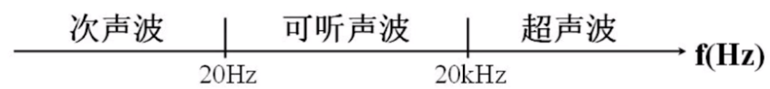

# 移动端音视频入门

## 1. 直播产品的种类

### 1.1 泛娱乐化直播

> 花椒、映客等娱乐直播，还有斗鱼、熊猫等游戏直播


- 共享端（主播端）：发起信令（礼物、聊天、创建房间）到`信令服务器`
- 信令服务器：收到信令后做一些相应的逻辑处理
- 流媒体云：即 通常所说的 **CDN 网络**,**对音视频流进行转发**，CDN 网络是泛娱乐直播中的最重要的部分。
- 观看端：收看节目

直播的流程：

- 共享端发送一个信令到信令服务器请求创建一个房间
- 信令服务器收到房间创建请求，在服务端创建一个房间，返回给共享端一个**流媒体云地址**
- 共享端采集自己音视频数据，形成 rtmp 流推送到 CDN 网络
- 观众端想观看直播，观众端客户端发送一条数据到信令服务器，信令服务器将该观众加入到该直播间，同时返回一个流媒体云地址
- 观众根据流媒体云地址，到CDN 网络拉取想看的流。

### 1.2 实时互动直播

> 音视频会议、教育直播，像思科、全时、声网


- TCP 协议：发送、确认、超时、重传

- UDP：有包就发，不关心对方是否收到

- 而音频数据有时效性，我现在说的话必须现在听到，过一会听到就失去了意义，所以UDP符合应用。

- TCP 有很成熟的 CDN 网络，而 UDP 没有，需要自己创建
- 为了提供可靠的 7*24h 服务，需要在服务端设置多个节点，一旦某个节点出现了问题，可以将服务切换到另一个节点，同时可以保证负载均衡。
- 因为节点多，所以需要一个控制中心。每个节点需要定期向控制中心进行报告 CUP 占用、网络占用等情况。控制中心根据当前节点的状况，分配任务。
- 节点与控制中心通信使用 `内总线`,可以保证数据安全，及高的吞吐量
- 有了实时互动架构以后与泛娱乐架构需要融合，实时互动网络使用 `UDP ` 网络进行通信，将 rtp 包通过 `内部总线`传输到 `媒体服务器` ,CDN 使用的是 rtmp 协议，所以媒体服务器需要将 `rtp`转换到 `rtmp`。
- 融合好的数据，推送到 CDN 网络。

## 2. CDN 网络

> CDN 网络是为了：解决用户访问网络资源慢而出现的一种数据。

- 为什么会出现用户访问资源慢呢？
    - 链路过长
    - 运营商与其它运营商之间的切割，访问限制

### 2.1 CDN 构成

- 边缘节点：用户从边缘节点上（离自己最近，访问速度最快的节点）获取数据
- 二级节点（主干节点）：主干网络节点，用于缓存，减轻源站压力。用户首先访问自己的边缘节点，如果边缘节点有数据直接返回给用户，否则向上请求主干节点，将主干节点缓存的数据拉到自己的边缘节点上，然后将数据返回给用户。
- 源站节点：CP(内容提供商)将内容放到源站。如果主干节点也没数据，主干节点自动向源站请求数据。

### 2.2 CDN 网络拓扑


- 每个运营商内部都要建自己的网络，例如:中国电信运营商，中国联通运营商
- 每个运营商网络内部都有多个**源节点**进行均衡负载。
- 为了解决运营商之间的限制，将两个运营商网络使用**主干节点，使用光纤对接**
- 用户访问资源流程
    - 用户(电信用户)通过 DNS ，或者HTTP的一个服务找到就近接入节点（边缘节点）
    - 向边缘节点请求数据，如果有直接返回给用户，如果没有向主干节点请求数据
    - 主干节点如果有数据则返回给边缘节点，否则查询该服务是由电信提供，还是由联通提供
    - 查询联通主干节点是否有数据，或者直接查询源节点

## 3. 搭建流媒体服务

- 准备流媒体服务器（Linux 或 Mac)

- 编译并安装 Nginx 服务

- 配置 RTMP 服务并启动 Nginx 服务

    ```
    # nginx 的 nginx.conf
    # 配置 rtmp server
    rtmp {                #RTMP服务
       server {
           listen 1935;  #//服务端口
            chunk_size 4096;   #//数据传输块的大小
           # 直播 指定流应用
           application live {
    	live on;
    	record off; # 关闭录制
    	allow play all; # 允许任何人发起请求
    	}
    	# 点播
            application vod {
                    play /home/annjeff/videoStore/vod; #//视频文件存放位置。
            }
       }
    }
    
    # nginx 默认监听端口是 80,被占用建议更改为:8080
    ```

- FFmpeg 直播命令

    ```
    # 推流 将 out.mp4  流推送到 rtmp服务器
    ffmpeg -re -i out.mp4 -c copy -f flv rtmp://server/live/streamName
    # -f flv: 推送格式是 flv
    # streamName：流的名字，自己指定，如 chatroom
    
    # 示例：将本地 dream.flv 推送到 rtmp://127.0.0.1:1935/rtmplive/room
    ffmpeg -re -i /home/annjeff/Video/dream.flv -c:a copy -c:v copy -f flv rtmp://127.0.0.1:1935/rtmplive/room
    
    # 如果不加上 -re 会出现报错1
    #[flv @ 02f99820] Failed to update header with correct duration.
    #[flv @ 02f99820] Failed to update header with correct filesize.
    ```

    ```
    # 拉流后写到本地文件
    ffmpeg -i rtmp://server/live/streanName -c copy dump.flv
    ```

    ```
    # 使用 ffplay 播放
    ffmplay rtmp://localhost:1935/live/room
    # 网络播放器播放
    http://bbs.chinaffmpeg.com/1.swf
    ```

## 4. 音频基础

### 4.1 音频基础知识

- 音调：就是音频，男生--> 女生 --> 儿童
- 音量：振动的幅度
- 音色：它与材质有很大关系，本质是谐波


### 4.2 心理声学原理

- 人类的听觉范围(音频处理时，范围外的声音可以直接丢弃)

    

- 其他动物听觉 / 发声范围

    

### 4.3 量化与编码

#### 4.3.1 量化过程


#### 4.3.2 量化基本概念

- 采样大小：一个采样用多少 bit 存放。常用的是 16bit。
- 采样率：采样频率 8k、16k、32k、44.1k（1s采集 4 万 4千 100 次）、48k
- 声道数：单声道、双声道、多声道（一个喇叭算一个声道）
- 码率计算：一个 PCM（ Pulse Code Modulation 脉冲编码调制）音频流的码率 = 采样率x采样大小x声道数 
    - 例子：采样率 44.1KHz, 采样大小为 16bit, 双声道的PCM 编码的 WAV文件,码率为：44.1Kx16x2=1411.2Kb/s

### 4.4 音频压缩技术

- 消除冗余数据(有损压缩技术)：将人类听觉范围外的音频数据直接删除。

    - 压缩的主要方法是去除采集到的音频冗余信息，所谓冗余信息包括人耳听觉范围外的音频信号及被掩蔽掉的音频信号。

    - 信号的掩蔽可以分为：

        - 频域掩蔽

            

        - 时域掩蔽

- 哈夫曼无损编码：可复原

### 4.5 音频编码过程


### 4.6 音频编解码器选型

#### 4.6.1 常见的音频编码器

- OPUS:比较常用，有口模型、耳模型两种模型（近两年推出，rtmp不支持）
- AAC：泛娱乐化直播系统比较常用，rtmp 支持
- Vorbis
- Speex： rtmp 支持，有回音消除、降噪等功能（我们可以借鉴移植）
- iLBC
- AMR
- G.711：音视频会议有时会与固话连接（固话常用G.711）

#### 4.6.2 音频编码器评测结果

- OPUS > AAC >Vorbis
- 

### 4.7 AAC

#### 4.7.1 为什么重点介绍 AAC？

- AAC 应用范围广，90% 以上直播系统使用 AAC
- RTMP 传输协议不支持 OPUS、但是支持 AAC
- AAC 音频编解码质量高，音频高保真

#### 4.7.2 AAC 产生目的

- AAC (Advanced Audio Coding) 目的是取代 MP3格式
- MPEG-4 标准出现后， AAC 加入了 SBR 技术和 PS 技术

#### 4.7.3 AAC常用的规格

- AAC LC:(Low Complexity) 低复杂度，码流128k
- AAC HE V1：AAC LC + SBR（Spectral Band Replication）分频复用，对低频与高频分别采样。高频增加采样，可以保证高频部分的音质，码流64k。
- AAC HE V2：AAC LC + SBR + PS(Parametric Stereo)，双声道分别保存，一个声道完整保存，另一个声道只存参数差异部分。因为音频双声道相关度很高，所以只存差异参数可以根据函数还原，码流32k。
- 

#### 4.7.4 AAC 的格式

- ADIF（Audio Data Interchange Format）
    - 这种格式智能从头开始解码，用于在磁盘文件中。
- ADTS （Audio Data Transport Stream）
    - 这种格式每一帧都有一个同步字，可以在音频流的任何位置开始解码，它类似于数据流格式。

#### 4.7.5 AAC 编码库哪个好？

> Libfdk（编码效率最高，最推荐使用）_AAC > ffmpeg AAC > libfaac > libvo_aacenc


### 4.8 视频入门

#### 4.8.1 视频基本知识

##### 4.8.1.1 H264 基本概念

- I 帧：关键帧，采用帧内压缩技术（第一帧，非常关键）
- P帧：向前参考帧，压缩时只参考前一个帧，属于帧间压缩技术
- B帧：双向参考帧，压缩时既参考前一帧也参考后一帧，帧间压缩技术
    - 网络直播时（实时互动）一般不选择 B 帧，因为需要等待网络传输后一帧

##### 4.8.1.2 GOF （一组帧）

- SPS （Sequence Parameter Set,序列参数集），存放帧数、参考帧数目、解码图像尺寸、帧场编码模式选择标识等。
- PPS （Picture Parameter Set, 图像参数集），存放熵编码模式选择标识、片组数目、初始化量化参数和去方块滤波系数调整标识等。
- 在 GOF（一组帧）之前，我们首先会收到 SPS、PPS,如果没这俩参数无法解码。
- SPS 、PPS 属于 I 帧。

##### 4.8.1.2 视频花屏/卡顿原因

- 如果 GOF 分组中的 P 帧丢失会造成解码端的图像发生错误。（花屏原因）
- 为了避免花屏问题的发生，一般如果发现 P 帧或者 I 帧丢失，就不显示本 GOF 内的所有帧，直到下一个 I 帧来后重新刷新图像。（卡顿原因）

##### 4.8.1.3 视频常用编码器

- x264 / x265
- openH264: 支持分层传输视频，一帧数据分为小中大三个部分，网络差只发小部分，网络好全发，每加一层图像越清晰。但是很多手机硬件功能不一定支持，需要软件解码（占用CPU）
- vp8 / vp9：谷歌推出，分别对应 x264 / x265

#### 4.8.2 H264 宏块的划分与帧分组(H264 编码原理)

##### 4.8.2.1 H264 压缩技术

- 帧内预测压缩，解决的**空域数据冗余**问题
- 帧间预测压缩，解决的**时域数据冗余**问题
- 整数离散余弦变换（DCT），将空间上的相关性变换为**频域上无关的数据然后进行量化
- CABAC 压缩，又称无损压缩

##### 4.8.2.2 H264 宏块划分


#### 4.8.3 视频压缩技术详解

##### 4.8.3.1 组内宏块查找


##### 4.8.3.2 帧间预测


##### 4.8.3.3 DCT 压缩


##### 4.8.3.4 无损压缩


#### 4.8.4 H264 结构与码流

##### 4.8.4.1 H264 结构


##### 4.8.4.2 码流基本概念

- SODB （String Of Data Bits）：原始数据比特流，长度不一定是 8 的整数倍，它是由 VLC 层产生的
- RBSP (Raw Byte Sequence Payload)：SODB + trailing bits，算法是在 SODB 最后一位补 1，不按字节对齐则补 0,补成 8 位对齐
- EBSP （Encapsulate Byte Sequence Payload ）：需到两个连续的 0x00 就增加一个 0x03
- NALU NAL Header(1B) + EBSP
    - NAL Unit
    - 

- 切片与宏块
    - 
- H264 切片
    - 

- H264 码流分层

    