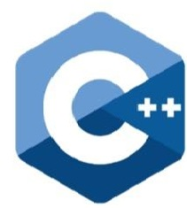

#  The-Note-of-Annjeff-for-Interview

##  C++ 基础

----

##  数据结构

---

##  数据库

---

##  计算机网络

### 物理层

### 数据链路层

### 网络层

### 运输层

### 应用层

---

##  算法题解

---

##  Tools

- ###  [Git](Tools\Git\Git基础.md)

