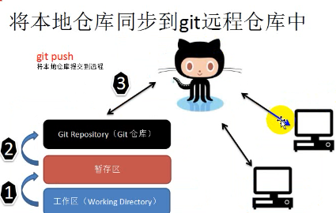
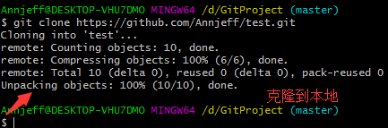

# Git 基础

##  一、初识 GitHub 

### 1.1 什么是 Git

​		Git 是一个免费、开源的**版本控制软件**

### 1.2 什么是版本控制系统

 		版本控制系统是一种**记录一个或若干个文件内容变化，以便将来查阅特定版本修改情况的系统。**

### 1.3 版本控制系统具体的功能

- 记录文件的所有历史变化

- 随时可恢复到任何一个历史状态

- 多人协作开发或修改项目

- 错误可恢复

### 1.4 什么是 GitHub？

​		GitHub 是全球最大的**社交编程**及**代码托管网站**

​		GitHub 可以托管各种 git 库，并提供一个 web 界面（用户名.github.io/仓库名）

### 1.5 GitHub 与 Git 的区别

- GitHub 与 Git 是完全不同的两个东西
- 在 Git 中，开发者将源码存入 `Git 仓库`的资料库中并加以使用
- GitHub 是在网络上提供 Git 仓库的一项服务
- GitHub 上公开的软件源代码全都由 Git 进行管理

---

## 二、使用 GitHub

### 2.1 使用 GitHub 的目的

​		借助 GitHub 托管项目代码

### 2.2 GitHub 中的基本概念

> a. 仓库（Repository)
>
> > 仓库用来存放项目代码，**每个项目对应一个仓库**，多个开源项目则有多个仓库。

> b. 收藏（Star)
>
> > 收藏项目，可以方便下次查看。

> c. 复制克隆项目（fork)
>
> > 查看别人项目时，如果希望将该项目保存到自己的仓库中，可以克隆复制该项目，到我们的账户下。
> >
> > 

**注意：**该 fork 的项目时独立存在的。

> d. 发起请求（Pull Request）
>
> > 我复制了别人的库，**我自己做了修改，我的库改动了，但是被复制人的库并没有改动。**此时，可以选择 pull request ，向库的拥有者发出请求。如果作者同意，我门书写的代码则会**合并到原来仓库中。**
> >
> > 

> e. 关注（Watch)
>
> > Watch 了某个项目，那么以后这个项目有任何更新，我门都会收到通知。

> f. 事物卡片（Issue）
>
> > 发现代码 BUG，但是目前没有成型代码，需要讨论时使用。

### 2.3 创建仓库/创建新项目

说明：

- 一个 Git 仓库对应一个开源项目
- 通过 git 管理 git 仓库

### 2.4 仓库管理

#### 2.4.1 新建文件

#### 2.4.2 编辑文件

#### 2.4.3 删除文件

#### 2.4.4 GitHub Issues

> 作用：发现代码 BUG ，但是目前没有成型代码，需要讨论时使用；或者使用开源项目出现问题时使用。

​		情景：张三发现李四开源的 git库，则提交了一个 Issue;李四隔天登录 GitHub 主页看到通知，可以和张三交流，最后关闭 Issue。

### 2.5 GitHub 基本概念的实践

#### 2.5.1 GitHub 主页

#### 2.5.2 个人主页

#### 2.5.3 收藏（Star)

#### 2.5.4 关注（Watch)

#### 2.5.5 复制克隆项目（Fork）

#### 2.5.6 发起请求(Pull request)

### 2.6 开源项目贡献流程

- 新建 issue
  - 提交使用中发现的问题或建议或想法
- Pull request
  - fork 项目
  - 修改自己仓库的项目代码
  - 新建 pull request
  - 等待作者操作（合并）

---

## 三、Git 基本概念

### 3.1 Git 的工作流程

### 3.2 Git 的三大分区

### 3.3 查看提交历史

> - `git log [分支名]` 查看某分支的提交历史，不写分支名查看当前所在分支
> - `git log --oneline` 一行显示提交历史
> - `git log -n` 其中 n 是数字，查看最近 n 个提交
> - `git log --author [贡献者名字]` 查看指定贡献者的提交记录
> - `git log --graph` 图示法显示提交历史

### 3.4 版本回退

> - 首先执行 `git reset --soft HEAD^` 撤销最近的一次提交，将修改还原到暂存区。`--soft` 表示软退回，对应的还有 `--hard` 硬退回
> - HEAD^^ 表示撤销两次提交，撤销 n 次可以简写为 HEAD~n
> - 软退回一个提交后执行 `git branch -avv` 命令查看分支信息
>

---

## 四、Git 初始化及仓库创建和操作

### 4.1 Git 基础设置

> 使用 Git 的第一件事就是设置名字和 email, 这是提交 commit 时的`签名`.

`git config --global user.name "annjeff"`

`git config --global user.email "annjeff@163.com"`

`git config --list` 查看设置

执行上述命令后，主目录(home directory)建立一个叫`~/.gitconfig`的文件.内容一般如下：

[user]

​	name = annjeff

​	email =  annjeff@163.com

### 4.2 初始化一个新的 Git 仓库

- 在任意位置新建一个文件夹，右键选择 Git Bash
- 使用 git init 命令初始化该文件夹

### 4.3 查看文件状态

> 使用 `git status` 命令，可以查看文件状态

### 4.4 把文件提交到暂存区

> `git add fileName`

### 4.5 把暂存区文件提交到仓库

>  `git commit -m "描述信息"`

### 4.6 删除仓库文件

#### 4.6.1 删除工作目录里文件

> `rm -f fileName`

#### 4.6.2 删除暂存区文件（勿使用）

> `git rm -r --cached 'fileName'`

> 误删除文件，没执行 commit 前，可以使用如下代码恢复：
>
> `git reset HEAD "fileName"`
>
> `git checkout -- "fileName"`

#### 4.6.3 删除文件后需要提交操作

> `git commit -m '提交描述'`

### 4.7 查看本地仓库所关联的远程仓库信息

> `git remote -v`

### 4.8 远程主机名

> Git 要求对**本地仓库关联的每个远程主机**都必须指定一个**主机名（默认为 origin）**，用于本地仓库识别自己关联的主机，`git remote` 命令就用于管理本地仓库所关联的主机，**一个本地仓库可以关联任意多个主机（即远程仓库）**。克隆远程仓库到本地时，还可以使用 `-o` 选项修改主机名，在地址后面加上一个字段作为本地仓库的主目录名

### 4.9 添加忽略文件

> 如果，希望 git 自动忽略一些文件，可以创建一个 `.gitignore` 文件，通过一些正则表达式自动忽略一些文件。

例1：忽略当前项目中以`.o 或 .a `结尾的文件

> `*.[oa]`

例2：忽略以 `~`结尾的文件

> `*~`

**一些模式匹配规则**

- 空行或以**#**开始的行自动忽略
- 可以使用标准的 `glob` 模式匹配
- 匹配模式可以以 （/) 开始，防止递归
- 匹配模式可以以 (/) 结尾，指定目录
- 可以使用 **!**开头忽略一个模式

---

## 五、Git 管理远程仓库

### 5.1 使用远程仓库的目的

> **备份，实现代码共享、集中化管理**

### 5.2 git 克隆操作

#### 5.2.1 目的

​		将远程仓库（GitHub对应的项目）复制到本地

#### 5.2.2 使用代码克隆仓库

> `git clone 仓库地址`
>
> git clone https://github.com/Annjeff/test.git

### 5.3 将本地仓库同步到 GitHub

#### 5.3 .1 提交到远端命令

> `git push `

#### 5.3.2 本地仓库使用 HTTPS 同步时出错解决办法

#### 5.3.3 Git 使用SSH 同步代码至 GitHub

##### 5.3.3.1 生成 SSH 密钥

>  **生成 SSH 密钥命令：**`ssh-keygen -t rsa -C 任意邮箱` 其中，`rsa`为加密算法

##### 5.3.3.2 到 GitHub 输入 SSH 密钥

> 此时 GitHub 已经知道我们的`公钥`是什么了，无需输入用户名和密码，可以直接和服务器安全通信。

##### 5.3.3.3 和远端建立连接

>  和远程仓库建立连接：`git remote add origin git@github.com:annjeff/The-Note-of-Annjeff-for-Interview.git`

##### 5.3.3.4 和远端连接出错

- **如果出现：fatal: remote origin already exists**

>  使用命令 git remote rm origin，再执行一次 git remote add origin 项目地址

将本地仓库推送到远程：`git push origin master`

#### 5.3.4 git push 提交出错解决办法

>  **git push 出现：rejected master -> master(non-fast-forward)**

> 解决方案一：[推荐] 利用强制覆盖方式，用本地代码替代 git 仓库内容
>
> `git push -f origin master`

> 解决方案二：先把 git 的代码 fetch 到本地，然后 merge ，最后 push
>
> `git fetch`
>
> `git merge`

