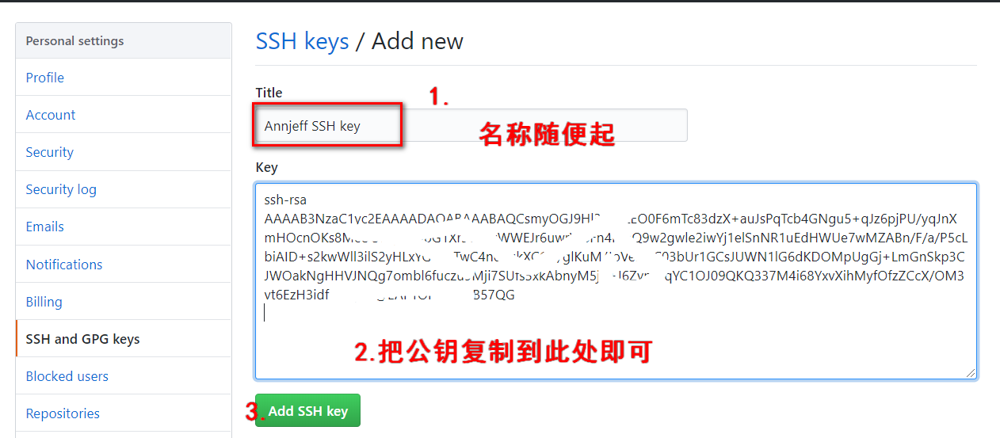

# Git 基础

##  初识 GitHub 

### GitHub 与 Git 的区别

- GitHub 与 Git 是完全不同的两个东西
- 在 Git 中，开发者将源码存入 `Git 仓库`的资料库中并加以使用
- GitHub 是在网络上提供 Git 仓库的一项服务
- GitHub 上公开的软件源代码全都由 Git 进行管理

### 

## Git 基本概念

## Git 常用命令

### Git 配置

> 使用 Git 的第一件事就是设置名字和 email, 这是提交 commit 时的`签名`.

`git config --global user.name "annjeff"`

`git config --global user.email "annjeff@163.com"`

执行上述命令后，主目录(home directory)建立一个叫`~/.gitconfig`的文件.内容一般如下：

[user]

​	name = annjeff

​	email =  annjeff@163.com

### Git 使用SSH 同步代码至 GitHub

**生成 SSH 密钥命令：**`ssh-keygen -t rsa`

到 GitHub

> 此时 GitHub 已经知道我们的`公钥`是什么了，无需输入用户名和密码，可以直接和服务器安全通信。

和远程仓库建立连接：`git remote add origin git@github.com:annjeff/The-Note-of-Annjeff-for-Interview.git`

将本地仓库推送到远程：`git push origin master`